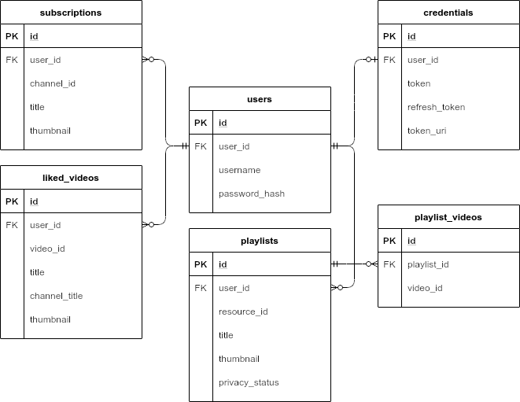

# YouTube Data Migrator App

The reason I chose this project idea was because I wanted to write something
unique, realistic, and for it to genuinely find use in a way that helps people.

I thought about how many people spend many, many, hours manually moving over
their YouTube data, usually because they had gotten a name change and preferred
unifying everything under a new account. After learning a little bit about the
[YouTube Data API] I decided that this is how I would make an app that people
would sincerely appreciate.

I started off with the simple plan that it would be a front end to a script
that allows users to migrate their data from one account to another. It wasn't
long before I realized that the number of components and design requirements
involved made this task far from simple.

Two months later, I had reached my goal while also making several new goals
moving forward.

In this article, I explain the process of how I developed this application.

The app itself can be found here: [https://yt-data-migrator.herokuapp.com](https://yt-data-migrator.herokuapp.com)

The github repo can be found here: [https://github.com/paigevenuto/yt-data-migrator](https://github.com/paigevenuto/yt-data-migrator)

-----

## Design Choices

Due to the sensitive nature of the API credentials, I needed the server to
handle all the YouTube Data API requests. This meant needing to hold the
imported data on the server, since the only alternative was storing it in the
session. Luckily, Google has a nice
[python library](https://github.com/googleapis/google-api-python-client)
to use for such purposes,
and I can use a PostgreSQL database to store the data I collect.



As far as linking the users' YouTube accounts, the solution is another
[Google-provided python library.](https://developers.google.com/identity/protocols/oauth2)
Incremental authorization is usually recommended, but because it requires the
user to authorize before every action I decided against it. I may change my
mind in later revisions if I can make incremental authorization more convenient
to the user.  

Due to this being a project with a focus on providing a unique service to
assist users with a very niche need, I wanted to design a familiar interface,
which lead me to implement [Material Design components.](https://material.io/).

-----

## Developer Policy Requirements

In order to be compliant with the [YouTube](https://developers.google.com/identity/protocols/oauth2/policies?hl=th) and [Google](https://developers.google.com/youtube/terms/developer-policies) developer polices, I had to include a
privacy policy on my site, and it had lots of criteria that you can't
get from an online generator tool. This meant typing one out manually, which
was a bit intimidating because I had never written a privacy policy before, and
it seemed like something with a lot of importance to not make mistakes with.

I ended up spending a few days writing down individual needs and
concerns, researching how to write a privacy policy, and looking at examples of
well-known privacy policies.

After a bit of revision, I think I ended up with [something workable.](https://yt-data-migrator.herokuapp.com/privacy)

Another requirement for developer policy compliance is that user data not be
stored for more than a month. I started off thinking I would resolve the issue
with cron before realizing Heroku only works using addons and dynos.  I then
spent some time investigating auto-vacuum with the expectation that it could be
configured to meet my needs, but unfortunately vacuum handles this task too
retroactively for my needs. I settled on using the Scheduler addon and
configuring a small python script to perform a few SQL queries daily and delete
data older than two weeks.

```python
timenow = datetime.datetime.utcnow().timestamp()
vids = LikedVideo.query.filter(LikedVideo.expiration_date <= timenow).all()
for vid in vids:
    db.session.delete(vid)
subs = Subscription.query.filter(Subscription.expiration_date <= timenow).all()
for sub in subs:
    db.session.delete(sub)
lists = Playlist.query.filter(Playlist.expiration_date <= timenow).all()
for plist in lists:
    db.session.delete(plist)

db.session.commit()
```

-----

## Security Requirements

To protect against **spoofing and session hijack**, I decided to handle login with
[JWT tokens](https://github.com/GehirnInc/python-jwt), which is a convenient
way to have secure token validation and
avoid easily guessable session IDs. It also holds the session info
encrypted in the token itself rather than needing a table in my database.

The next concern I had was **CSRF**. Luckily,
[WTForms](https://flask-wtf.readthedocs.io/en/stable/) has built in CSRF
validation, so I have CSRF protection covered with minimal effort.

Another simple trick, is that I can configure Flask to only use HTML-only cookies
which prevents other applications from accessing user cookies using
JavaScript.

```python
SESSION_COOKIE_SAMESITE = 'Strict'
```

The last vulnerability I wanted to protect against was **sniffing**, which means
using HTTPS. In this case, Heroku runs on HTTPS without me having to do
anything extra. I simply serve on whatever port is specified in Heroku's
environmental variable and it handles the rest.

```python
import os
from waitress import serve

PORT = os.environ['PORT']
serve(app, port=PORT)
```

-----

## Big Problems I Ran Into

### Problem One

I realized it was a problem that the Google API Client library needed me to
store my Google API credentials in a client__secrets.json file. This is because
Heroku is pulling my source code from Github, and any configuration is done
using environmental variables rather than a secrets file. I had trouble finding
documentation on how to use the API any other way, but I did eventually find a
Stack Overflow post which saved the day. A simple fix for a simple problem, but
the journey to get there was quite uncertain.

[https://stackoverflow.com/questions/51601915/how-to-use-the-google-api-without-checking-a-client-secret-json-into-version-con](https://stackoverflow.com/questions/51601915/how-to-use-the-google-api-without-checking-a-client-secret-json-into-version-con)  

### Problem Two

I had some difficulty with the OAuth popup, the revoke API was actually
different from revoking permissions manually, since it doesn't pull the app off
the authorized apps list. It was just disabling the refresh token, which
isn't great because then the user can't simply re-authorize with your app if
they change their mind, instead they have to visit their Google security
settings and remove it there first.

As far as I am currently aware, there isn't a way to make this behave as
expected and I'll have to leave it like this.

### Problem Three

After being confused over some errors where the refresh token was received with
the value of `None`, I found my solution on Stack Overflow. Unfortunately this
was where I realized that not only is there an issue with trying to authorize
the same account twice, but that since there is also an issue with the revoke
route. That meant that I had to redesign my app in a way that holds onto
multiple credentials while also preventing a user from trying to authorize the
same account a second time. This will be a strech goal for sure.

[https://stackoverflow.com/questions/51883184/google-oauth2-not-issuing-a-refresh-token-even-with-access-type-offline](https://stackoverflow.com/questions/51883184/google-oauth2-not-issuing-a-refresh-token-even-with-access-type-offline)  

### Problem Four

Turns out that the API doesn't allow you to view subscribed playlists,
subscribe to playlists, or view the watch later playlist.

Unfortunately, there is no solution to this one, it'll just have to be left out.

:(

### Problem Five

The last issue I ran into was automatically closing the popup window
after authorizing an account.

I tried using the `Window` object, the Web Workers API, and spent a while
looking for other ideas with no success.

After a while of not finding a solution I made a temporary solution of
rendering the message `'You may now close this window.'` It's awkward, but
at least it's better than nothing. Figuring out a better way to do this is
definitely going to be a stretch goal.

## Final Thoughts

I definitely became a lot more conscious of scope and time constraints after
reaching this point in the app.  It's in a complete state, but I wouldn't call
it done, because I have been thinking of several stretch goals for various ways
that I want to improve the app as time goes on. I actually want this app to
reach the point where it helps some people out, and in order to do that I want
to reach the quality expectations needed before I apply for a quota increase
from Google.  

Google still hasn't even verified this app's OAuth consent screen, which is a
clear indication that I still have lots of areas that I need to improve.

Here are some of my goals, in no particular order:

- Accessibility features
- Consider turning the login and sign up screens into dialogs
- Pass in a value for the "algorithms" argument when calling decode()
- Add a creds selector or incremental auth
- Add error handling and logging
- separate concerns of processing form data and API calls
- OOP for api client and JS
- Handle playlist descriptions and tags
- Progress animations
- Checkbox to select entire category
- Add playlist contents to pre-exesting playlists of the same name
- More extensive unit testing

